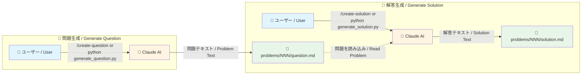
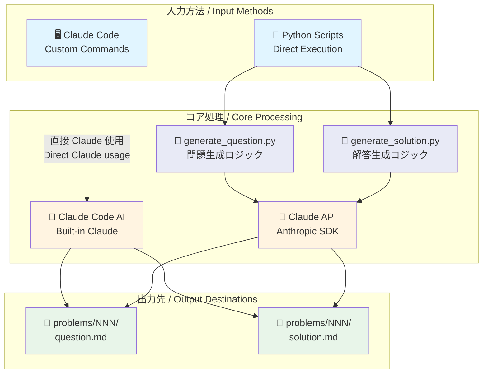

# 麻雀何切る問題集 / Mahjong Nanikiru Problems

麻雀の何切る（なにきる）問題のコレクションです。Claude AI を使用して問題と解説を生成できます。

A collection of "What to discard" problems in Mahjong. Problems and explanations can be generated using Claude AI.

## アーキテクチャ / Architecture

### ワークフロー / Workflow



### システムアーキテクチャ概要 / System Architecture Overview



## 現在の運用 / Current Status

現在は **手動運用** です。Claude Code のカスタムコマンドまたは Python スクリプトを使用して、問題と回答を生成します。

Currently operates **manually**. Problems and answers are generated using Claude Code custom commands or Python scripts.

## 将来の計画 / Future Plans

将来的には以下の自動化を予定しています（Anthropic API キー取得後）：

1. **午前9時（JST）**: GitHub Actions で自動的に問題を生成
   - `problems/NNN/question.md` として保存
   - GitHub Issue に問題を投稿

2. **午後6時（JST）**: GitHub Actions で自動的に回答を生成
   - `problems/NNN/solution.md` として保存
   - Pull Request で回答を投稿し、自動マージ
   - 対応する Issue をクローズ

> **Note**: GitHub Actions のワークフローファイルは `.github/workflows-disabled/` に保存されています。
> Anthropic API キーを取得したら、`.github/workflows/` に移動して有効化できます。

## 使用方法 / Usage

### Claude Code のカスタムコマンド（推奨）

Claude Code を使用している場合、カスタムコマンドで問題と回答を生成できます：

```bash
/create-question  # 新しい問題を生成
/create-solution  # 既存の問題に対する回答を生成
```

生成されたファイルは `problems/` ディレクトリに保存されます。

### Python スクリプト（Anthropic API キーが必要）

Anthropic API キーを持っている場合、Python スクリプトを直接実行できます：

```bash
# 依存関係のインストール
pip install -r requirements.txt

# 環境変数の設定
export ANTHROPIC_API_KEY=your_api_key_here

# 問題の生成（次の番号で自動生成）
python scripts/generate_question.py
# → problems/001/question.md が作成される

# 特定の番号で問題を生成
python scripts/generate_question.py 5
# → problems/005/question.md が作成される

# 回答の生成（最新の問題に対する回答）
python scripts/generate_solution.py
# → problems/001/solution.md が作成される

# 特定の問題に対する回答を生成
python scripts/generate_solution.py 5
# → problems/005/solution.md が作成される

# 問題一覧を表示
python scripts/list_problems.py

# テーマでフィルタリング
python scripts/list_problems.py --theme リーチ

# 難易度でフィルタリング
python scripts/list_problems.py --difficulty 5
```

## 問題の仕様 / Problem Specification

生成される問題には以下が含まれます：

- **難易度**: 10段階（★☆☆☆☆☆☆☆☆☆ 1/10 から ★★★★★★★★★★ 10/10）
- **テーマ**: 問題の種類（リーチ判断、手役選択、押し引き、待ち選択、形式テンパイ、鳴き判断、安全牌選択など）
- **局面情報**: 場、自風、ドラ表示牌、巡目
- **手牌**: 13枚の麻雀牌（Unicode表記）
- **河（捨て牌）**: 自分、下家、対面、上家の捨て牌
- **状況説明**: 必要に応じた追加情報

## ディレクトリ構造 / Directory Structure

```
.
├── problems/                   # 生成された問題と回答
│   ├── 001/
│   │   ├── question.md
│   │   └── solution.md
│   ├── 002/
│   │   ├── question.md
│   │   └── solution.md
│   └── ...
├── scripts/                    # Python スクリプト
│   ├── generate_question.py    # 問題生成
│   ├── generate_solution.py    # 回答生成
│   └── list_problems.py        # 問題一覧表示
├── .claude/commands/           # Claude Code カスタムコマンド
│   ├── create-question.md
│   └── create-solution.md
├── .github/
│   └── workflows-disabled/     # 将来の自動化用（現在無効）
│       ├── create-question.yml
│       └── create-solution.yml
└── requirements.txt            # Python 依存関係
```

## ライセンス / License

MIT License - 詳細は [LICENSE](LICENSE) を参照してください。
